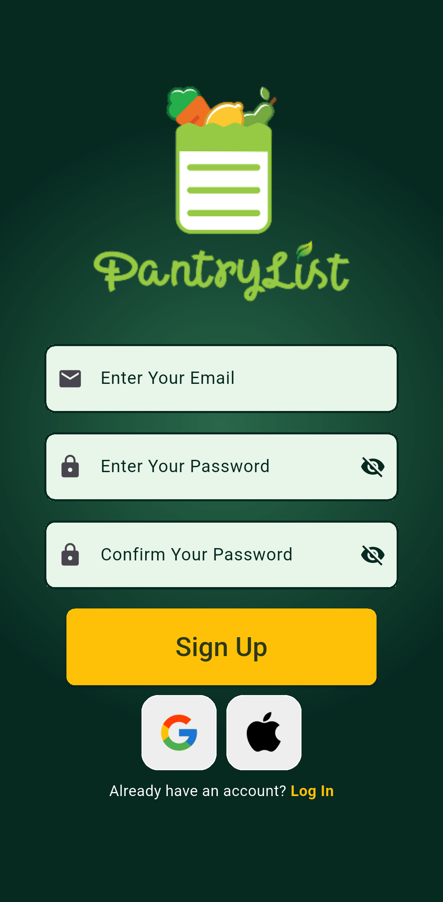
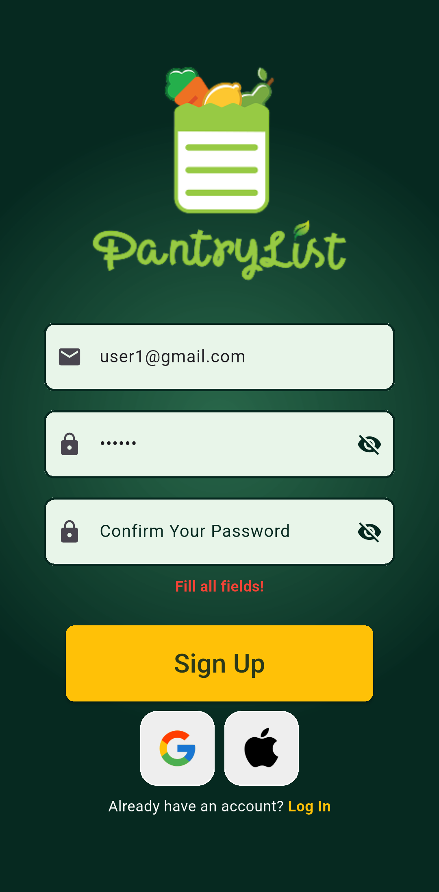
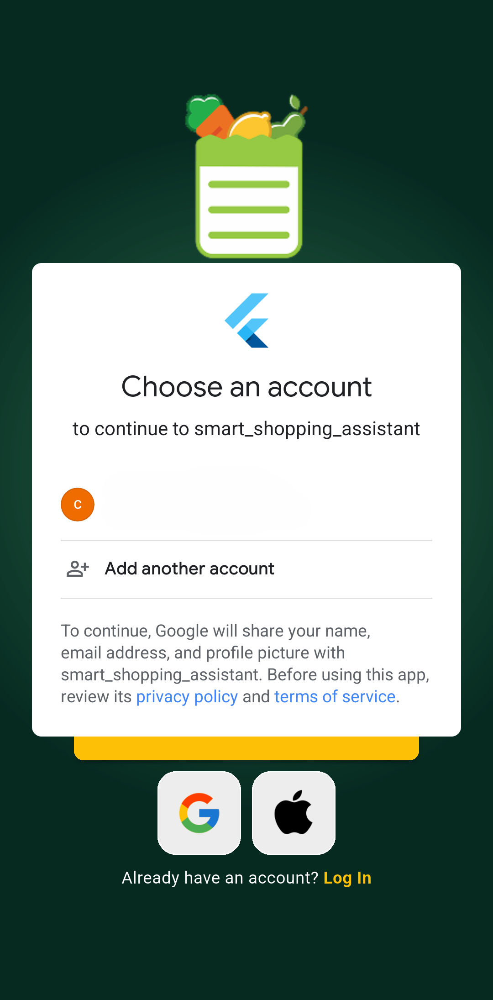
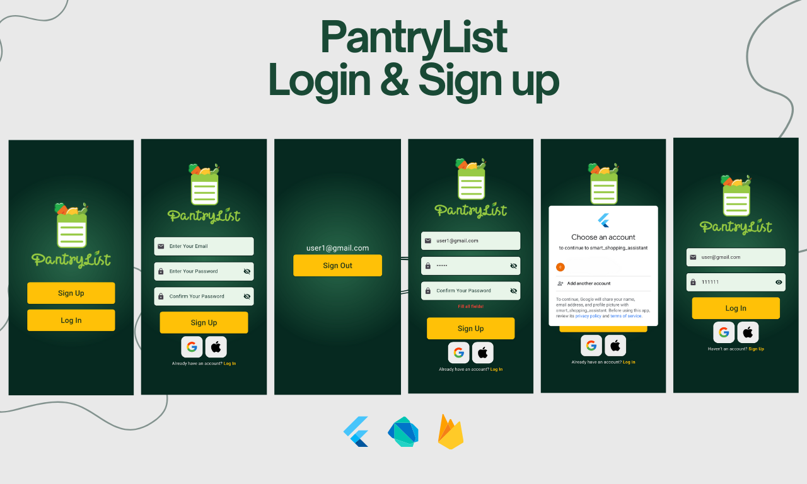

🚀 Introducing My Latest Flutter Project: Smart Shopping Assistant Sign up & Login With Google and Apple ID 🛒

🔑 Key Features:

1. Auto-Login Functionality: 
 - The app automatically detects if a user is already logged in using Firebase Authentication and navigates them directly to the home screen. 
 - New users are greeted with a welcome screen to get started.

2. User Authentication: 
 - Secure login and signup functionality using Firebase Authentication. 
 - Email and password validations ensure a smooth and secure user experience.

3. Dynamic Navigation: 
 - Predefined routes for seamless navigation between screens:
 - Welcome Screen
 - Home Screen
 - Login Screen
 - Signup Screen

4. Performance Optimizations: 
 - Smooth scrolling experience with "BouncingScrollPhysics" for a polished and responsive UI.

5. Scalable Architecture: 
 - Modularized code structure for easy maintenance and scalability.

6. Custom Scroll Behavior: 
 - Enhanced user experience with custom scroll configurations for a natural feel.

🛠️ Tech Stack:

- Flutter: For building a cross-platform mobile application. 
- Firebase: For backend services like authentication and app initialization. 
- Dart: The programming language powering Flutter.

## Screenshots

<table>
  <!-- Row 1 -->
  <tr>
    <td></td>
    <td></td>
    <td></td>
  </tr>
  <!-- Row 2 -->
  <tr>
    <td></td>
    <td></td>
    <td></td>
  </tr>
  <!-- Row 3 -->
  <tr>
    <td></td>
  </tr>
</table>
